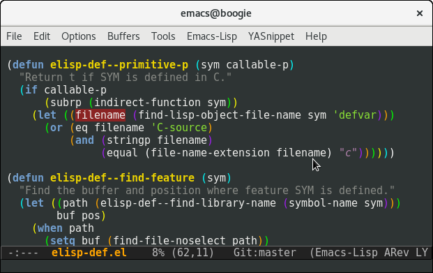

# elisp-def [](http://www.melpa.org/#/elisp-def) [](https://travis-ci.org/Wilfred/elisp-def) [](https://coveralls.io/github/Wilfred/elisp-def?branch=master)

Go to the definition of the symbol at point. Supports global
definitions, local definitions, and even macro-heavy code!



`elisp-def` statically analyses your code, and falls back to
heuristics where that's not possible. It should work 99% of the time,
so please file bugs if it can't find definitions for your code.

## Installation

Install from MELPA, then add the following to your Emacs
configuration:

``` emacs-lisp
(dolist (hook '(emacs-lisp-mode-hook ielm-mode-hook))
  (add-hook hook #'elisp-def-mode))
```

## Global Definitions

`elisp-def` will find the definition of global functions and global
variables at point.

``` emacs-lisp
(defun demo/foo ()
  1)

(defun demo/bar ()
  ;; M-x eval-buffer, then elisp-def on this:
  (demo/foo))
```

It will also use edebug information to find function definitions, so
it finds definitions more often than xref.

## Lisp-2 Awareness

`elisp-def` understands the difference between symbols and functions
and jumps to the correct definition.

``` emacs-lisp
(require 'cc-mode)

;; `c-version' is both a variable and a function.

(defun demo/foo ()
  ;; `elisp-def` will find the function here.
  (c-version))

(defun demo/foo ()
  ;; `elisp-def` will find the variable here.
  (setq c-version t))
```

`elisp-def` understands macros too.

``` emacs-lisp
(require 'dash)

(defvar demo/foo nil)

(defun demo/foo (x)
  x)

(defun demo/bar ()
  (->> 123
       ;; `elisp-def' knows that this is a function, even though there are
       ;; no parens.
       demo/foo))
```

## Find Libraries

`elisp-def` will find libraries, displaying the `provide` declarations
if possible.

``` emacs-lisp
;; `elisp-def' will open python.el here.
(require 'python)

;; Unlike `xref-find-definition', `elisp-def' will not confuse this
;; library name with the macro named `use-package'.
(require 'use-package)

;; `elisp-def' will even find python.el here, because the macro
;; expands to a call to `require'.
(use-package python
  :config
  (setq python-indent-guess-indent-offset-verbose nil))
```

## Local Bindings

`elisp-def` understands local bindings and parameters.

``` emacs-lisp
(defun demo/foo (bar)
  (let ((foo 1))
    ;; `elisp-def' on the FOO below will move point to the let
    ;; binding.
    (setq foo 2)
    ;; `elisp-def' on the BAR below will move point to the function
    ;; parameters line.
    (setq bar 3)))

(defun demo/bar ()
  (let* ((foo 1)
         (bar 2)
         (foo 3)
         ;; `elisp-def' on the second FOO on the following line will
         ;; move point to the relevant binding, which is the line
         ;; immediately above.
         (foo (+ foo 1))
         (foo 5))
    nil))
```

This even works with macros that introduce bindings.

``` emacs-lisp
(require 'dash)
(eval-when-compile
  (require 'cl-lib))

(defun demo/foo (items)
  (cl-destructuring-bind (first second) items
    ;; `elisp-def' knowns that FIRST is bound on line above.
    (message "first is %s" first))
  (-let [(first . rest) items]
    ;; `elisp-def' knowns that FIRST is bound on line above.
    (message "first is %s" first)))
```

## Ergonomics

`elisp-def` allows you to put point on quoted symbols, docstring
symbols or backquoted symbols.

``` emacs-lisp
(defun demo/foo (x)
  ;; `elisp-def' on X in the docstring will find the parameter.
  "Adds one to X and returns it."
  (1+ x))

(defun demo/bar ()
  ;; `elisp-def' can find demo/foo even when point is on the #.
  (funcall #'demo/foo 1)
  ;; `elisp-def' on demo/foo below will find the function.
  ;;
  ;; See `demo/foo' for more information.
  nil)

(defun demo/baz (foo)
  ;; `elisp-def' understands that @ is not part of foo here.
  `(blah ,@foo))
```

When it finds the symbol, elisp-def will also temporarily highlight it for
visibility.

## Caveats

`elisp-def` is limited in its ability to analyse quoted symbols.

``` emacs-lisp
;; `elisp-def' is able to find these quoted symbols because they're
;; only globally bound in one namespace.
(mapcar 'symbol-name '(foo bar baz))
(add-to-list 'auto-mode-alist '("\\.java\\'" . java-mode))

(require 'cc-mode)
(defun demo/calls-fn (sym)
  (funcall sym))

;; Since `c-version' is both a function and a variable, and we're not
;; using a sharp-quote #'c-version, we have to prompt the user.
(demo/calls-fn 'c-version)

(defun demo/foo (c-version)
  ;; Here we have no idea whether we're using `c-version' as a
  ;; function (e.g. funcall), as a variable (e.g. set) or as a
  ;; parameter (e.g. eval).
  (bar 'c-version nil))
```

`elisp-def` cannot find definitions in macros with `let*` semantics
and duplicated variables.

``` emacs-lisp
(require 'dash)

(defun demo/foo ()
  (-let ((x 1)
         (x 2))
    ;; `elisp-def' on X below will move to the first X binding, rather
    ;; than the second.
    x))
```

`elisp-def` also cannot handle macros that rewrite forms such that the
symbol disappears entirely.

``` emacs-lisp
(eval-when-compile (require 'cl-lib))

(cl-labels ((foo (x y) (+ x y)))
  ;; `cl-labels' completely rewrites this body to (--cl-foo-- 1 2), so
  ;; `elisp-def' can't find the definition of FOO.
  (foo 1 2))
```

## Thanks/Inspirations

* `elisp-slime-nav-find-elisp-thing-at-point`
  from [elisp-slime-nav](https://github.com/purcell/elisp-slime-nav)
* `xref-find-definitions` in `emacs-lisp-mode` (part of Emacs
  core)
* `semantic-ia-fast-jump` from `semantic/ia.el` (included in Emacs)

The fine folks on `#emacs` for answering my questions on elisp
esoterica, particularly Wasamasa.

The [compliment](https://github.com/alexander-yakushev/compliment)
library for Clojure completion has a notion
of [context](https://github.com/alexander-yakushev/compliment/wiki/Context)
which is very similar to how elisp-def extracts and analyses forms.
